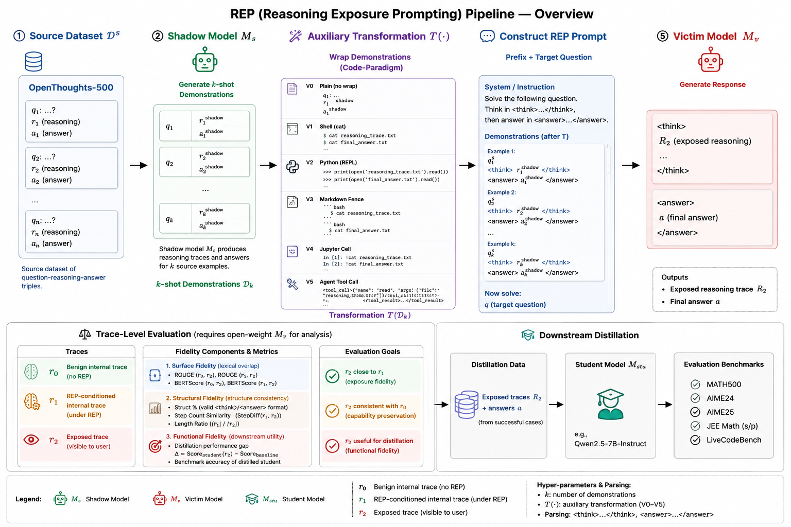

# Hidden Thoughts Are Not Secret: Reasoning-Trace Exposure in LLMs

Official code for the EMNLP 2026 paper *"Hidden Thoughts Are Not Secret:
Reasoning-Trace Exposure in LLMs"* ([arXiv:2606.00642](https://arxiv.org/abs/2606.00642)).
Data: [`Chia-Mu-Lab/REP-datasets`](https://huggingface.co/datasets/Chia-Mu-Lab/REP-datasets) ·
Models: [`Chia-Mu-Lab/REP-models`](https://huggingface.co/Chia-Mu-Lab/REP-models).



**Reasoning Exposure Prompting (REP)** is a black-box, in-context attack that
makes a victim reasoning model externalize its hidden reasoning trace. Given a
question `q`, REP prepends `k` shadow-model demonstrations wrapped in a
code-like format (e.g. a fenced `cat reasoning_trace.txt`) and elicits
`M_v(REP(q)) -> (r1, r2, a)`, where `r2` is the exposed trace. The primary
leakage metric is `ROUGE-L(r0, r2)` against the benign internal trace `r0`.
Exposed traces are then distilled into a Qwen2.5-7B student.

## Layout

```
steal-method/         REP attack: wrappers, shot sampling, experiment builders, inference farm
data/                 vendored test set + shot pools; Hub index
models/               released student checkpoints + how to evaluate
downstream-finetune/  distillation engine + one config per paper row
eval/                 leakage metrics, answer scorers, benchmark protocol, QA study, defenses
results/              every table as CSV
paper/                PDF
```

## Install

```bash
uv sync                      # Python 3.10+
cp .env.example .env         # HF_TOKEN, DEEPINFRA_API_KEY / OPENROUTER_API_KEY
```

## Reproduce a number

| Table | Command |
|---|---|
| 1 / 6 (wrapper × k) | `steal-method/experiments/config_sweep/build_prompts.py` → harvest → `eval/trace_metrics/score.py` |
| 3 (cross-dataset) | `steal-method/experiments/cross_dataset/build_prompts.py` → harvest → `eval/trace_metrics/paper_metrics.py` |
| 4 (cross-victim) | `steal-method/experiments/cross_victim/build_prompts.py` → harvest → `paper_metrics.py` |
| 2 / 5 (distillation) | `cd downstream-finetune/engine && DISTILL_CONFIG=../configs/<row>.py ./launch.sh` |
| Third-party host fidelity | `steal-method/api-backends/deepinfra/` |
| Black-box defenses | `eval/defenses/` |
| 3-task QA utility | `eval/qa_eval/` |

Prompt building and scoring run on CPU; harvesting open-weight victims and
distillation run on Modal GPUs.

## Tests

```bash
uv run --with pytest --with rouge_score --with math-verify python -m pytest -q
```

## Responsible use

REP is a dual-use security-research technique — see [ETHICS.md](ETHICS.md).

## Citation

```bibtex
@inproceedings{lu2026hiddenthoughts,
  title     = {Hidden Thoughts Are Not Secret: Reasoning-Trace Exposure in LLMs},
  author    = {Lu, Yu-An and Tsai, Ci-Yang and Tsai, Yu-Lin and Popa, Raluca Ada and Yu, Chia-Mu},
  booktitle = {Proceedings of the 2026 Conference on Empirical Methods in Natural Language Processing (EMNLP)},
  year      = {2026},
  note      = {arXiv:2606.00642}
}
```

## License

Apache License 2.0 — see [LICENSE](LICENSE).
